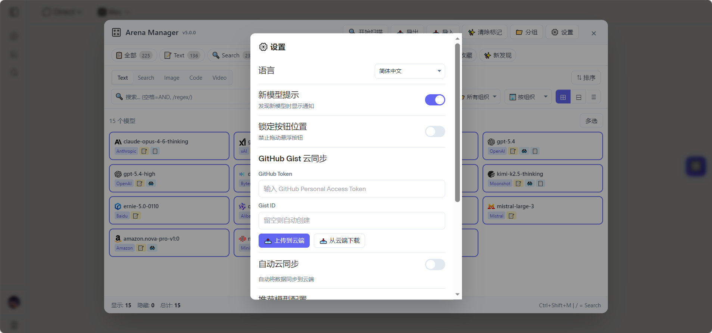
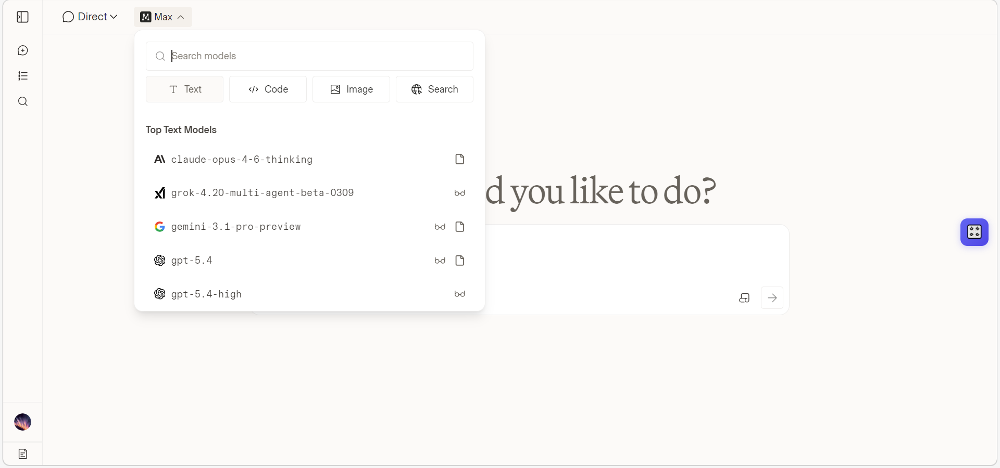

# 🎛️ LMArena Manager

> 智能管理 LMArena 模型显示的油猴脚本

告别混乱的模型列表！LMArena Manager 助你轻松筛选、分类和管理上百个 AI 模型。支持 **Chat**、**Code**、**Image** 等多种模式的独立管理与排序。

# ✨ 核心特性

- **🚀 多模式归属系统 (v4.4 新增)**：一个模型（如 GPT-4o）可以同时属于 Chat 和 Code 面板，支持在不同场景下独立管理显隐和排序。
- **🎯 "所见即所得" 精准扫描**：严格基于页面上下文识别模型类型，不再依赖不可靠的名字猜测，杜绝分类错误。
- **🏢 智能厂商识别**：内置规则自动识别 **60+ 家**主流 AI 公司（OpenAI, Google, Anthropic, DeepSeek 等）。
- **📂 智能折叠**：自动收纳非核心公司，保持列表清爽；在模型较少的模式下自动展开。
- **🔄 自定义排序**：支持拖拽调整公司顺序，把你喜欢的厂商排在最前。
- **🏷️ 智能标签**：自动打标 **⚡快速**、**🧠思考**、**👑旗舰**、**📱轻量**、**🔓开源** 等特性。
- **☁️ 配置同步**：支持导出/导入 JSON 配置，多设备轻松同步。

## 📸 截图预览

## 🎮 支持的 Arena 模式

脚本完美适配 LMArena 的所有评测模式：

| 模式 | 图标 | 说明 |
|------|------|------|
| Chat | 💬 | 标准文本对话 |
| Search | 🔍 | 联网搜索增强 |
| Image | 🎨 | 图像生成模型 |
| Code | 💻 |代码编程专用 |
| Video | 🎬 | 视频生成模型（预留） |

## 📦 安装

### 前置要求
- 浏览器安装 [Tampermonkey](https://www.tampermonkey.net/) 或 [Violentmonkey](https://violentmonkey.github.io/)

### 安装方式

**方式一：从 Greasy Fork 安装（推荐）**

**方式二：手动安装**

1. 点击浏览器扩展图标 → 添加新脚本
2. 复制 [`lmarena-manager.user.js`](./lmarena-manager.user.js) 内容
3. 保存并启用

## 🚀 使用方法

1. 访问 [LMArena](https://lmarena.ai)
2. 点击页面上的模型选择下拉框（让模型列表加载）
3. 点击右上角 **🎛️** 按钮 或按 **Ctrl+Shift+M**
4. 点击 **🔄 扫描** 获取模型列表
5. **单击**模型卡片切换显示/隐藏
6. **双击**模型卡片编辑详细信息
7. 点击 **✓ 应用** 使更改生效
8. 其余功能欢迎自行探索！

## ⌨️ 快捷键

| 快捷键 | 功能 |
|--------|------|
| `Ctrl+Shift+M` | 打开/关闭管理面板 |
| `Esc` | 关闭当前弹窗 |

## 🏢 支持的公司

点击展开完整列表

（重复公司只展示一次）
  
### LLM
Google, OpenAI, Anthropic, xAI, DeepSeek, Qwen, MoonshotAI, Zhipu, Baidu, MistralAI, LongCat, Xiaomi, Tencent, Minimax, Amazon, PrimeIntellect, IBM, Cohere, AntGroup, Stepfun, Meta, Nvidia, AllenAI, Inception

### Search
Perplexity, Diffbot

### Image
Bytedance, ShengShu, MicrosoftAI, Flux, Recraft, Luma, Ideogram, Reve, LeonardoAI

### Code
Kwai

## 🏷️ 类型标签

| 标签 | 含义 | 匹配规则 |
|------|------|----------|
| ⚡ 快速 | 低延迟模型 | flash, fast, turbo, haiku |
| 🧠 思考 | 深度推理模型 | thinking, reasoner, o3, o4 |
| 👑 旗舰 | 顶级性能 | pro, max, ultra, high |
| 📱 轻量 | 轻量高效 | mini, nano, small |
| 🔓 开源 | 开源模型 | llama, qwen, glm, deepseek... |

## 📝 更新日志

### v4.4.2 (2026-01-19)

**🎉 重磅更新：多模式归属与精准扫描**

*   **✨ 多模式归属 (Multi-Mode Attribution)**
    *   底层数据结构重构，支持一个模型同时属于多个模式。
    *   例如：`GPT-4o` 既可以在 Chat 面板管理，也可以在 Code 面板独立管理，互不冲突。
*   **🎯 严格上下文扫描**
    *   移除基于名称正则的猜测逻辑，完全基于 DOM 按钮状态判断当前模式。
    *   在 Code 页面扫到的就是 Code 模型，绝无误判。
*   **💄 UI/UX 精修**
    *   **防抖动**：锁定顶栏高度，防止滚动条出现时布局微小跳动。
    *   **对齐修复**：优化下拉框 Emoji 图标对齐，视觉更舒适。
*   **🐛 Bug 修复**
    *   修复了 Code 模式下混合显示 Chat 模型时，自定义排序失效的问题。

### v4.3.0 (2026-01-17)

#### 🌟 新增与优化
*   **智能折叠逻辑优化**
    *   现在“📁 更多公司”折叠夹仅在 `All` 和 `LLM` 模式下启用。
    *   切换到模型较少的 `Search`、`Image`、`Code`、`Video` 模式时，所有公司将自动展开，方便直接查找。
*   **上栏布局重构**
    *   上栏按钮现在支持自动换行，彻底去除了横向滚动条。
    *   优化了按钮尺寸和间距，布局更紧凑、美观。
    *   主面板宽度限制适当增大，适应更多内容显示。
*   **排序功能增强**
    *   **修复了折叠夹内无法排序的问题**：现在支持在“更多公司”文件夹内部拖拽调整公司顺序。

#### 🐛 问题修复
*   **界面修复**：修复了左侧栏“更多公司”行与其他公司行的统计数字无法垂直对齐的视觉瑕疵。
*   **图标修复**：修复了 **MicrosoftAI** (Copilot/Bing) 图标无法正常显示的问题。
*   **代码清理**：优化了部分内部逻辑。

---

### v4.1.0 (2026-01-10)

*   ✨ **核心功能**：支持 5 种 Arena 模式切换 (LLM / Search / Image / Code / Video)。
*   ✨ **智能识别**：内置 60+ 家主流 AI 公司的识别规则。
*   ✨ **交互升级**：支持公司列表拖拽排序。
*   ✨ **自定义**：支持模型信息手动编辑。
*   ✨ **工具**：新增清空列表/重置功能。
*   🐛 **修复**：修正 Code 模式下的分类逻辑问题。

### v1.0.0
- 初始版本

## 🤝 贡献

欢迎提交 Issue 和 Pull Request！

- 🐛 Bug 反馈请附带浏览器版本和控制台错误信息
- ✨ 新功能建议请描述使用场景

## 📄 许可证

[MIT License](./LICENSE)

## 🙏 致谢

- [LMArena](https://lmarena.ai) - 模型评测平台
- [Tampermonkey](https://www.tampermonkey.net/) - 用户脚本管理器

---

**如果这个项目对你有帮助，欢迎 ⭐ Star！**
